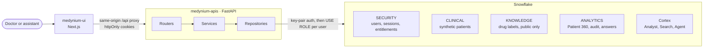
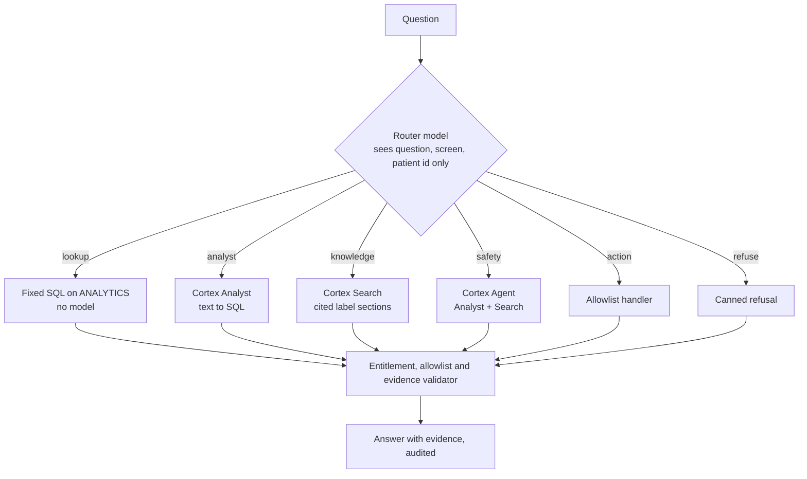
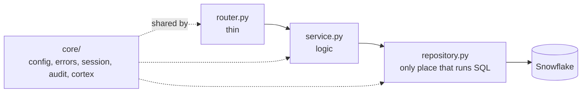

# Medynium API

**A governed Patient 360 and clinical agent, built on Snowflake.**

Medynium gives a doctor one place to see a patient's whole story and ask questions about it. Every answer shows the evidence behind it, and the AI can only see what the signed-in user is allowed to see. This repo is the backend: a FastAPI service in front of Snowflake and Snowflake Cortex.

> Synthetic data only. Decision support, not diagnosis. Built for the Snowflake CoCo CLI Hackathon 2026.

The web app lives in the sibling repo, `medynium-ui`, and talks to this API only.

## Why it is different

| Promise | How the API keeps it |
| --- | --- |
| **The AI sees no more than the user** | Every request runs in Snowflake under the caller's own role, with row access policies. No shared service role reads patient data. |
| **Denied looks the same as missing** | A patient you cannot open returns the exact same `404 not_found` as one that does not exist. |
| **Evidence or nothing** | A validator maps each answer statement to a patient record or a source chunk and drops anything unbacked. "Nothing found in the indexed sources" is never written as "no risk". |
| **The agent can do four things** | `open_patient`, `show_timeline`, `run_safety_review`, `pin_evidence`. The list is enforced on the server and anything else is audited and refused. |
| **Prompt injection is data, not instructions** | Text inside notes and drug labels is never followed as a command. |

## Architecture



Snowflake is the only datastore: no Postgres, Redis or vector store.

### How a question is answered

A small model reads each free-text question and picks one route. The strongest model is used only when patient data and documents must be combined.



The router is not a security boundary. Entitlement, allowlist and evidence checks run again on every route, and a failed router never produces an action.

### Layers inside the code



`tests/test_architecture.py` enforces the rules: a feature never imports another feature, only repositories (and `core/`) import the Snowflake driver, and files stay under 300 lines.

## Tech stack

| Area | Choice |
| --- | --- |
| Language and framework | Python 3.12, FastAPI, Uvicorn, Pydantic v2 |
| Data and AI | Snowflake (key-pair auth, row access policies), Cortex Analyst, Cortex Search, Cortex Agent |
| Models | Router `llama3.1-8b`, strong model `claude-sonnet-4-6` (both configurable) |
| Auth | Argon2id passwords, JWT access and refresh cookies, optional email sign-in code |
| Streaming | Server-sent events (`sse-starlette`) for the assistant and safety review |
| Email | Resend (optional; invite and reset links still work without it) |
| Tooling | Poetry, Poe the Poet, Ruff, mypy strict, pytest, pre-commit |
| Deploy | Docker on Google Cloud Run (`scripts/deploy.py`), GitHub Actions CI |

## Repo map

```text
src/medynium_api/
  main.py, router.py        app entry and the mount point for every feature
  core/                     config, error contract, sessions, audit, evidence, Cortex clients
  features/                 one self-contained folder per endpoint group
    auth/  patients/  dashboard/  copilot/  evidence/
    knowledge/  audit/  admin/  pins/  views/  health/
snowflake/                  idempotent setup SQL, numbered in run order (00 to 90)
data/, knowledge/           loaders and seed data
evals/                      golden, injection and routing question sets
scripts/                    db, deploy, evals, key and user setup, OpenAPI export
docs/                       API, database, architecture, quality and eval reports
tests/                      unit, architecture and live Snowflake tests
```

Each feature folder has its own `README.md` card: purpose, endpoints, requirement IDs and what it may import.

## Quick start

Requirements: Python 3.12 and [Poetry](https://python-poetry.org/) 2.x.

```bash
poetry install
cp .env.example .env          # Windows: copy .env.example .env
poetry run poe dev            # http://localhost:8000/docs
```

`/health` works with no Snowflake credentials. Everything else needs a Snowflake account set up as described in [docs/database/data-loading.md](docs/database/data-loading.md). Fill in `.env` from [.env.example](.env.example); every variable is explained in [docs/external-dependencies.md](docs/external-dependencies.md).

If the UI runs on another origin, set `REFRESH_COOKIE_PATH=/api/auth` so the refresh cookie is scoped to the proxied path.

If another project's virtualenv is active, run `deactivate` first or Poetry will install into that environment.

## Daily commands

| Command | What it does |
| --- | --- |
| `poetry run poe dev` | Run with reload on port 8000 |
| `poetry run poe check` | Ruff lint, format check, mypy strict, tests. Run before every commit |
| `poetry run poe test:int` | Live tests against Snowflake and the seeded demo users |
| `poetry run poe openapi` | Rewrite `docs/api/openapi.json` (the UI generates its types from it) |
| `poetry run poe db:apply` / `db:check` / `db:status` | Apply, verify and report the Snowflake setup SQL |
| `poetry run poe eval:routing` / `eval:golden` / `eval:injection` | Run the routing, golden and prompt-injection evals |

## Quality at a glance

Figures from the latest [test report](docs/quality/test-report.md), run against the real Snowflake account and seeded users.

| Check | Result |
| --- | --- |
| Golden set | 15 of 15 |
| Hero safety review stability | 12 of 12 across three phrasings |
| Prompt-injection set | 12 of 12 |
| Database checks | 17 of 17 |
| Retrieval (recall@5) | 1.0 across 36 queries |
| Routing set | 30 of 35 |
| Hero latency | p50 24 s against a 20 s target |

## Deploy

`poetry run python scripts/deploy.py` builds the image with Cloud Build and rolls it out to the `medynium-api` Cloud Run service. Add `--setup` the first time to enable the APIs and create the registry, service account and secrets. A `render.yaml` Blueprint is also kept for Render. CI (`.github/workflows/ci.yml`) runs the checks, confirms the OpenAPI file is fresh and builds the Docker image on every push.

## Docs

- [Architecture overview](docs/architecture/overview.md), [AI layer](docs/architecture/ai-layer.md), [security and access](docs/architecture/security-and-access.md), [decisions](docs/architecture/decisions.md)
- [API reference](docs/api/README.md) and [database](docs/database/README.md)
- [Quality reports](docs/quality/test-report.md) and [access and safety matrix](docs/quality/access-and-safety-matrix.md)
- [External dependencies](docs/external-dependencies.md)
- [AGENTS.md](AGENTS.md): working rules for contributors and AI sessions

## Rules that must not be broken

1. Entitlement first: denied and missing patients return the same 404.
2. Every query runs under the user's own Snowflake role; no runtime path uses `MED_ADMIN`.
3. The agent's action set is closed and checked on the server.
4. Every answer statement has evidence or is dropped.
5. No secrets in the repo and none in logs; errors use `{error, message}`.
6. Setup scripts and loaders are idempotent.
