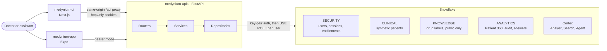
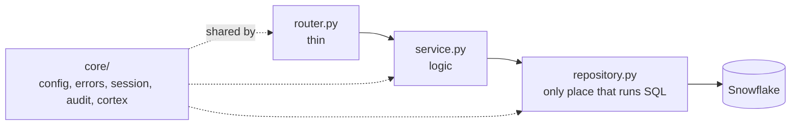
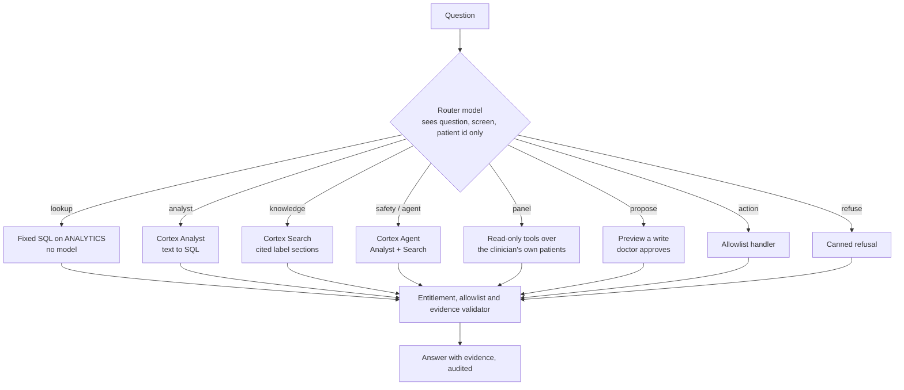
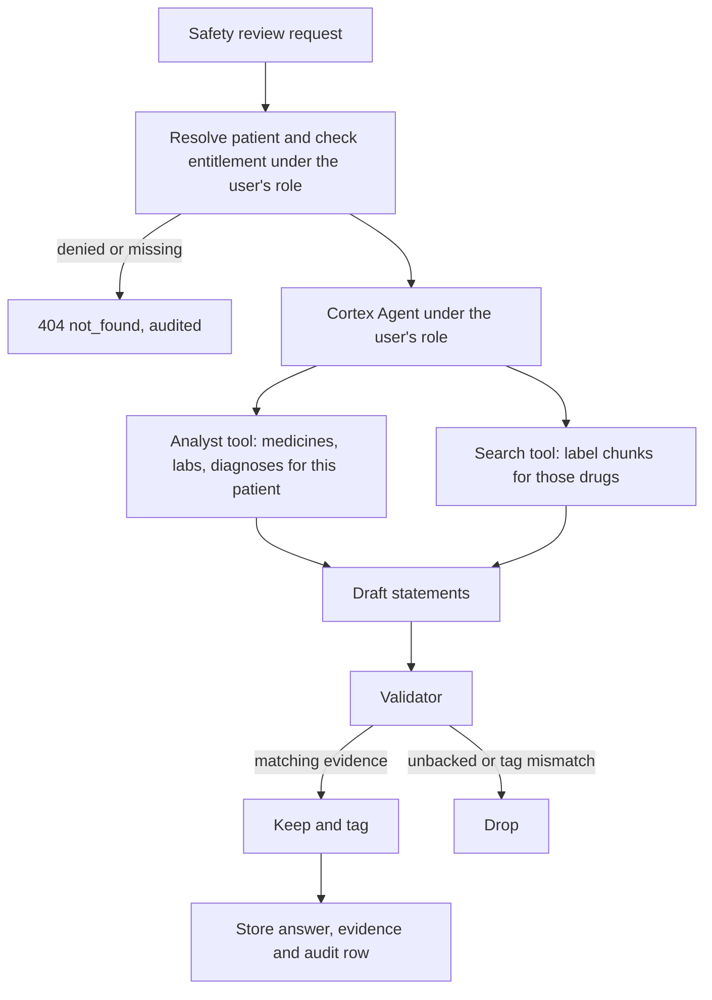
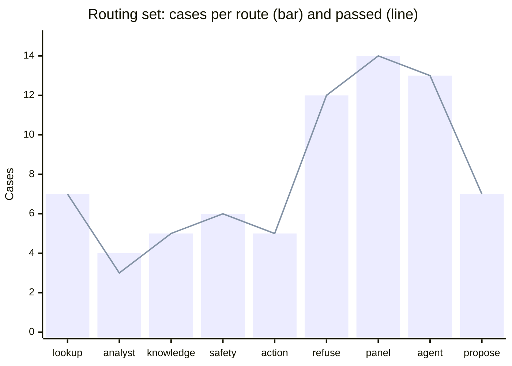

<div align="center">

<!-- MEDIA: banner. Suggested file: docs/media/banner.png (1600x400) -->


# Medynium API

### A governed Patient 360 and clinical agent, built on Snowflake.

The backend where access control binds the AI, every answer carries evidence, and the agent can only do what it is allowed to do.


**[Interactive API docs](#quick-start)** · **[Evaluation](docs/evaluation/README.md)** · **[Diagrams](docs/architecture/diagrams.md)** · **[UI repo](../medynium-ui)** · **[Mobile repo](../medynium-app)**

</div>

> **Synthetic data only. Decision support, not diagnosis.** Built for the Snowflake CoCo CLI Hackathon 2026.

---

## Table of contents

1. [Why this backend is different](#why-this-backend-is-different)
2. [Impact](#impact)
3. [Real-world use cases](#real-world-use-cases)
4. [Capabilities](#capabilities)
5. [Architecture](#architecture)
6. [How a question is answered](#how-a-question-is-answered)
7. [Security and governance model](#security-and-governance-model)
8. [Data model on Snowflake](#data-model-on-snowflake)
9. [API surface](#api-surface)
10. [Quality and evaluation](#quality-and-evaluation)
11. [Tech stack](#tech-stack)
12. [Repo map](#repo-map)
13. [Quick start](#quick-start)
14. [Daily commands](#daily-commands)
15. [Deploy](#deploy)
16. [Roadmap and honest limits](#roadmap-and-honest-limits)
17. [Docs](#docs)
18. [Rules that must not be broken](#rules-that-must-not-be-broken)

---

## Why this backend is different

Most clinical AI demos stop at "ask a question, get an answer". Medynium treats the hard parts as the product: who may see what, where each claim came from, and what the AI is permitted to do.

| Promise | How the API keeps it |
| --- | --- |
| **The AI sees no more than the user** | Every request runs in Snowflake under the caller's own role, with row access policies. No shared service role reads patient data. |
| **Denied looks the same as missing** | A patient you cannot open returns the exact same `404 not_found` as one that does not exist, with padded latency. |
| **Evidence or nothing** | A validator maps each answer statement to a patient record or a source chunk and drops anything unbacked. "Nothing found in the indexed sources" is never written as "no risk". |
| **A closed set of agent actions** | `open_patient`, `show_timeline`, `run_safety_review`, `pin_evidence`. Enforced on the server; anything else is audited and refused. |
| **The agent proposes, a human decides** | The assistant can prepare a note, allergy, diagnosis or medicine as a preview. Only a doctor's approval writes it. |
| **Prompt injection is data, not instructions** | Text inside notes, reports and drug labels is never followed as a command. |
| **Everything is audited** | Every question, action, refusal and denial is written, with the prompt version hashed into the row. |

---

## Impact

- **Clinical safety, not just convenience.** The hero safety review connects a patient's documented history to the exact section of a drug label, turning a task that means opening several systems and a PDF into one cited answer.
- **Trust that survives scrutiny.** Reviewers, auditors and clinicians can ask "why did it say that?" and get the records, the SQL and the source section, every time.
- **Honest about what it does not know.** A medicine with no indexed label returns a gap, not a guess, which removes the most dangerous kind of clinical-AI error: false reassurance.
- **Governance that holds up for sensitive data.** Entitlements are enforced by the database, so the AI layer cannot be talked into crossing a boundary the user does not have.
- **One platform, small footprint.** Structured data, document search, the agent and row-level security all live in Snowflake. There is no Postgres, Redis or vector store to secure, sync or pay for.
- **Built for its market.** Indian brand names resolve to generic drugs, claims are in INR, and the medicine corpus includes the National List of Essential Medicines.

No deployment or user study has been run, so none of this is a claim about hours saved or outcomes improved. The full argument, with evidence and limits, is in [impact and use cases](docs/evaluation/impact-and-use-cases.md).

---

## Real-world use cases

| Use case | Who | What the API provides | Proof |
| --- | --- | --- | --- |
| **Pre-consult review** | Treating doctor | Worklist with change flags and a rule-based brief of what changed and what is missing | Data screens p50 about 1 s, no model |
| **Medicine safety check** against kidney function, allergies and labels | Treating doctor | A cited review joining the lab trend to the label section | 3 of 3 hero cases, recall@5 of 1.0 |
| **Emergency and discharge follow-up** | Doctor, covering doctor | One pending list shared with the assistant, so screen and chat cannot disagree | 14 live pending tests |
| **Medicines with no label** (Indian brands, typos) | Doctor, admin | Brand resolution, honest gaps, coverage requests | 8 of 8 negative queries honest |
| **Paper reports to records** | Doctor, assistant | Extraction with quoted words and page; a doctor approves each row | 13 live report tests |
| **Several doctors, one hospital** | Admin, compliance | Entitlements enforced by Snowflake; denied equals missing | 200-request role-leakage test |
| **Audit and accountability** | Compliance reviewer | Every question, action, refusal and denial, with the prompt version hashed in | Stream equals audit row |

Ten use cases are written up with their limits in [docs/evaluation/impact-and-use-cases.md](docs/evaluation/impact-and-use-cases.md#4-real-world-use-cases).

---

## Capabilities

| Capability | What it does | Feature folder |
| --- | --- | --- |
| **Patient 360** | List, overview, medications, labs and trends, timeline, claims, notes, all under entitlement | `patients/` |
| **Dashboard and brief** | Worklist with change flags, utilisation, and a rule-based patient brief of what changed and what is missing, no model needed | `dashboard/`, `brief/` |
| **Clinical assistant** | Routes free text to the cheapest safe handler, streams steps over SSE, validates every statement | `copilot/` |
| **Safety review** | Cortex Agent combining Cortex Analyst (patient facts) and Cortex Search (label text) into tagged, cited statements | `copilot/` |
| **Evidence (Why?)** | Records, SQL and source sections behind any answer | `evidence/`, `pins/` |
| **Findings** | A clinician's recorded decision on a statement: acknowledge, follow up, escalate or dismiss, with rules enforced server-side | `findings/` |
| **Pending work** | One view of open findings, due follow-ups, unreviewed abnormal labs and recent emergency visits, shared with the assistant so they cannot disagree | `pending/` |
| **Knowledge search** | Cited label search with brand and typo resolution, honest gaps and nearby suggestions | `knowledge/`, `drug_coverage/` |
| **Reports intake** | PDF or image to structured rows with quoted source words and page, doctor approval required | `reports/` |
| **Records (write path)** | Doctors register patients and add, edit, archive and restore clinical records, versioned with an insert-only history | `records/` |
| **Similar patients** | Embedding plus structured overlap across the clinician's own patients, explained and never padded | `similar/` |
| **Saved views** | Preview first, nothing stored without approval | `views/` |
| **Audit** | The caller's own audit entries, denials included | `audit/` |
| **Auth and admin** | Argon2id passwords, refresh rotation with reuse detection, lockout, optional emailed code, invites, entitlements | `auth/`, `admin/` |

---

## Architecture

<!-- MEDIA: optional polished export. Suggested: docs/media/architecture.png -->


Snowflake is the only datastore. External data (Synthea, openFDA, the A-Z India medicines dataset) is read at ingestion time by a person; no outside API is called at run time.

### Layers inside the code



More diagrams (sign-in and refresh, proposal approval, report intake, finding and report state machines, write path, ingestion order, delivery pipeline) are in the [diagram gallery](docs/architecture/diagrams.md).

`tests/test_architecture.py` enforces the rules: a feature never imports another feature, only repositories (and `core/`) import the Snowflake driver, and files stay under 300 lines.

---

## How a question is answered

A small model reads each free-text question and picks one route. The strongest model is used only when patient data and documents must be combined.



The router is not a security boundary. Entitlement, allowlist and evidence checks run again on every route, and a failed router never produces an action. Cheap routes (fixed SQL, label search) skip the strong model entirely, which keeps cost and latency low.

### The safety review



---

## Security and governance model

| Layer | Control |
| --- | --- |
| **Identity** | Argon2id passwords, JWT access and refresh cookies (bearer mode for mobile), refresh rotation with reuse detection, lockout, optional emailed code |
| **Database access** | Key-pair auth for the service, then `USE ROLE` to the caller's own role per request. No runtime path uses the admin role |
| **Row-level security** | Row access policies on entitlements, including the vector table behind similar-patient search |
| **Denial semantics** | Denied and missing are indistinguishable in body and timing, and no error message ever carries a patient ID |
| **AI boundary** | The router never sees patient records or document text. Agent tools are a closed list with validated arguments |
| **Write path** | Doctors only, versioned, idempotent, double-checked for entitlement (API, then inside Snowflake), written through procedures owned by a dedicated writer role |
| **Evidence** | Statements without matching evidence are dropped; AI synthesis is tagged as such |
| **Injection** | Instructions inside notes, labels or uploaded reports are treated as text and noted, never obeyed |
| **Audit** | One writer for every route, including denials; prompts are versioned files hashed into each row |
| **Secrets** | Only `.env.example` in the repo; nothing sensitive in logs |

The access and safety checks are mapped to tests in [docs/quality/access-and-safety-matrix.md](docs/quality/access-and-safety-matrix.md).

---

## Data model on Snowflake

| Schema | Holds |
| --- | --- |
| `SECURITY` | Users, invites, sessions, entitlements |
| `CLINICAL` | Synthetic patients, encounters, medications, labs, notes, claims, reports |
| `INTAKE` | Report stage and the write procedures |
| `KNOWLEDGE` | Public drug-label chunks and the Cortex Search service |
| `ANALYTICS` | Precomputed Patient 360 read models, pending items, audit, answers and evidence, findings, patient embeddings |

Setup SQL lives in `snowflake/`, numbered in run order and idempotent. Seed data and loaders are in `data/` and `knowledge/`. See [docs/database/](docs/database/README.md).

---

## API surface

Interactive docs at `/docs` once the server is running. The committed contract is [docs/api/openapi.json](docs/api/openapi.json), which the UI and mobile app generate types from.

| Group | Representative endpoints |
| --- | --- |
| Auth | `POST /auth/login`, `/auth/refresh`, `/auth/logout`, `GET /me` |
| Patients | `GET /patients`, `/patients/{id}`, `/medications`, `/labs`, `/timeline`, `/claims`, `/notes` |
| Brief and pending | `GET /patients/{id}/brief`, `/changes`, `/gaps`, `GET /pending` |
| Assistant | `POST /copilot/ask` (SSE), `POST /patients/{id}/safety-review`, `POST /agent/actions` |
| Evidence | `GET /evidence/{answer_id}`, pins under `/patients/{id}/pins` |
| Findings | `GET/POST /patients/{id}/findings`, `PATCH /findings/{id}` |
| Knowledge | `GET /knowledge/search`, `/knowledge/drugs`, `POST /knowledge/requests` |
| Reports and records | `POST /patients/{id}/reports`, record writes under `/patients/{id}/{kind}` |
| Similar and views | `GET /patients/{id}/similar`, `POST /views/preview`, `POST /views` |
| Audit and admin | `GET /audit`, `/admin/users`, `/admin/invites`, `/admin/knowledge/coverage` |
| Health | `GET /health` (no credentials needed) |

Errors always use `{ "error": "...", "message": "..." }` with codes from `core/errors.py`.

---

## Quality and evaluation

Live runs against the real Snowflake account and seeded users. Failures are listed, not hidden. The summary below is the latest committed artifacts; tables, charts, method and open issues are in the **[evaluation hub](docs/evaluation/README.md)**.

| Check | Result | Detail |
| --- | --- | --- |
| Unit and architecture tests, lint, format, mypy strict | **250 passed**, clean (2026-10-06) | [results](docs/evaluation/results.md#1-scoreboard) |
| Live integration (22 files, 157 test functions) | green per file after fixes | [test report](docs/quality/test-report.md) |
| Database checks | 17 of 17, policy coverage and entitlement | [security](docs/evaluation/security-evaluation.md) |
| Golden question set | **18 of 19** (95%); G09 is an open model-variance case | [golden](docs/evaluation/results.md#2-golden-question-set) |
| Prompt-injection set | **12 of 12** | [injection](docs/evaluation/results.md#3-prompt-injection-set) |
| Routing set | **72 of 73 (98.6%)**, hard cases 10 of 10 | [routing](docs/evaluation/results.md#4-routing) |
| Retrieval over the label corpus (74 positive, 8 negative queries) | recall@3, recall@5 and MRR of 1.0; negatives answered honestly | [retrieval](docs/evaluation/results.md#5-retrieval-over-the-drug-label-corpus) |
| Ground truth | Every shown number equals its SQL | [ground truth](docs/evaluation/results.md#6-ground-truth) |
| Latency | Data endpoints about 1 s. Safety review p50 24 s against a 20 s target, streamed live | [performance](docs/evaluation/performance-and-cost.md) |
| Cost | 0.02 credits for a timed run of about 100 calls | [cost](docs/evaluation/performance-and-cost.md#5-cost) |



Reproduce:

```bash
poetry run poe check                      # unit and architecture
poetry run poe test:int                   # live tests against Snowflake (run per file)
poetry run poe eval:routing               # routing set
poetry run python scripts/eval_golden.py --set all
```

---

## Tech stack

| Area | Choice |
| --- | --- |
| Language and framework | Python 3.12, FastAPI, Uvicorn, Pydantic v2 |
| Data and AI | Snowflake (key-pair auth, row access policies), Cortex Analyst, Cortex Search, Cortex Agent |
| Models | Router `llama3.1-8b`, strong model `claude-sonnet-4-6` (both configurable) |
| Auth | Argon2id passwords, JWT access and refresh cookies, optional email sign-in code |
| Streaming | Server-sent events (`sse-starlette`) for the assistant and safety review |
| Email | Resend (optional; invite and reset links still work without it) |
| Tooling | Poetry, Poe the Poet, Ruff, mypy strict, pytest, pre-commit |
| Deploy | Docker on Google Cloud Run (`scripts/deploy.py`), GitHub Actions CI |

---

## Repo map

```text
src/medynium_api/
  main.py, router.py        app entry and the mount point for every feature
  core/                     config, error contract, sessions, audit, evidence, Cortex clients
  features/                 one self-contained folder per endpoint group
    auth/  patients/  dashboard/  brief/  copilot/  evidence/  pins/
    findings/  pending/  knowledge/  drug_coverage/  reports/  records/
    similar/  views/  audit/  admin/  quality/  health/
snowflake/                  idempotent setup SQL, numbered in run order
data/, knowledge/           loaders and seed data
evals/                      golden, injection and routing question sets
scripts/                    db, deploy, evals, key and user setup, OpenAPI export
docs/                       API, database, architecture, quality and eval reports
tests/                      unit, architecture and live Snowflake tests
```

Each feature folder has its own `README.md` card: purpose, endpoints, requirement IDs and what it may import.

---

## Quick start

Requirements: Python 3.12 and [Poetry](https://python-poetry.org/) 2.x.

```bash
poetry install
cp .env.example .env          # Windows: copy .env.example .env
poetry run poe dev            # http://localhost:8000/docs
```

One-command Snowflake setup (idempotent; `--dry-run` lists the steps, `--from N` resumes, `--with-eval` also runs the evals):

```bash
poetry run python scripts/gen_keypair.py   # once
poetry run poe setup                       # bootstrap, schemas, data, knowledge, search, users, checks
```

`/health` works with no Snowflake credentials. Everything else needs a Snowflake account set up as described in [docs/database/data-loading.md](docs/database/data-loading.md). Fill in `.env` from [.env.example](.env.example); every variable is explained in [docs/external-dependencies.md](docs/external-dependencies.md).

If the UI runs on another origin, set `REFRESH_COOKIE_PATH=/api/auth` so the refresh cookie is scoped to the proxied path. If another project's virtualenv is active, run `deactivate` first or Poetry will install into that environment.

<!-- MEDIA: docs/media/swagger-docs.png, a screenshot of /docs -->


---

## Daily commands

| Command | What it does |
| --- | --- |
| `poetry run poe dev` | Run with reload on port 8000 |
| `poetry run poe check` | Ruff lint, format check, mypy strict, tests. Run before every commit |
| `poetry run poe test:int` | Live tests against Snowflake and the seeded demo users |
| `poetry run poe openapi` | Rewrite `docs/api/openapi.json` (the UI generates its types from it) |
| `poetry run poe db:apply` / `db:check` / `db:status` | Apply, verify and report the Snowflake setup SQL |
| `poetry run poe eval:routing` / `eval:golden` / `eval:injection` | Run the routing, golden and prompt-injection evals |

---

## Deploy

`poetry run python scripts/deploy.py` builds the image with Cloud Build and rolls it out to the `medynium-api` Cloud Run service. Add `--setup` the first time to enable the APIs and create the registry, service account and secrets. A `render.yaml` Blueprint is also kept for Render. CI (`.github/workflows/ci.yml`) runs the checks, confirms the OpenAPI file is fresh and builds the Docker image on every push.

---

## Roadmap and honest limits

- One golden case (G09, a medicine with no indexed label) occasionally gets a drafted conclusion instead of the honest gap. The planned fix is a code rule, not a prompt change.
- Cortex latency varies from run to run, so a full safety review takes tens of seconds. Streaming keeps the user informed; reducing round trips and context size is active work.
- The label corpus is US labelling. A drug without an indexed label returns a gap, and clinicians can request coverage for an admin to add.
- Report extraction is English only and needs legible print; handwriting is not supported.
- Router misses are covered by server-side rules: entitlement, allowlist and evidence checks never depend on the route chosen.
- Similar-patient quality is measured on a proxy only.
- Synthetic data only, one clinic, about 300 patients: the figures show behaviour, not clinical validation.
- Negation and family-history handling rests on prompt rules and three golden cases; there is no rule-based negation parser.
- Decision support, not diagnosis: the assistant never doses, prescribes or says a medicine is safe.
- Next: a de-identified analyst role with its own access model, alerts and review queues, and broader label and regulatory coverage.

---

## Docs

- [Architecture overview](docs/architecture/overview.md), [AI layer](docs/architecture/ai-layer.md), [security and access](docs/architecture/security-and-access.md), [decisions](docs/architecture/decisions.md)
- [API reference](docs/api/README.md) and [database](docs/database/README.md)
- [CoCo evidence](docs/coco-evidence.md): skills, hooks, measured runs, and [data provenance](data/PROVENANCE.md)
- **[Evaluation hub](docs/evaluation/README.md)**: [results](docs/evaluation/results.md), [feature coverage](docs/evaluation/feature-coverage.md), [security](docs/evaluation/security-evaluation.md), [performance and cost](docs/evaluation/performance-and-cost.md), [impact and use cases](docs/evaluation/impact-and-use-cases.md)
- [Diagram gallery](docs/architecture/diagrams.md)
- [Quality reports](docs/quality/test-report.md) and [access and safety matrix](docs/quality/access-and-safety-matrix.md)
- [External dependencies](docs/external-dependencies.md)
- [Media shot list](docs/media/README.md)
- [AGENTS.md](AGENTS.md): working rules for contributors and AI sessions

---

## Rules that must not be broken

1. Entitlement first: denied and missing patients return the same 404.
2. Every query runs under the user's own Snowflake role; no runtime path uses `MED_ADMIN`.
3. The agent's action set is closed and checked on the server.
4. Every answer statement has evidence or is dropped.
5. No secrets in the repo and none in logs; errors use `{error, message}`.
6. Setup scripts and loaders are idempotent.
