# Diagram gallery

Every diagram here is Mermaid, so GitHub renders it in place. The core system diagrams (context, layers, routing, safety review, ER) also appear in the [README](../../README.md), [overview](overview.md) and [database docs](../database/README.md); this page adds the ones that show behaviour over time and under failure.

| # | Diagram | Type | Answers |
| --- | --- | --- | --- |
| 1 | [Workspace map](#1-workspace-map) | flowchart | How the three repos connect |
| 2 | [Containers and trust boundaries](#2-containers-and-trust-boundaries) | flowchart | What runs where, and what is trusted |
| 3 | [Sign-in, refresh and reuse detection](#3-sign-in-refresh-and-reuse-detection) | sequence | How sessions are issued and revoked |
| 4 | [One request under the user's role](#4-one-request-under-the-users-role) | sequence | How a role reaches Snowflake |
| 5 | [Assistant answer, end to end](#5-assistant-answer-end-to-end) | sequence | Router, handler, validator, audit |
| 6 | [A proposal and its approval](#6-a-proposal-and-its-approval) | sequence | Why the assistant cannot write |
| 7 | [Report intake](#7-report-intake) | sequence | Paper to approved rows |
| 8 | [Finding lifecycle](#8-finding-lifecycle) | state | What a clinician's decision allows |
| 9 | [Report and row lifecycle](#9-report-and-row-lifecycle) | state | Statuses of a report and its rows |
| 10 | [Record write path](#10-record-write-path) | flowchart | Double entitlement check, versioning |
| 11 | [Data ingestion and build order](#11-data-ingestion-and-build-order) | flowchart | How data and labels get into Snowflake |
| 12 | [Schemas and roles](#12-schemas-and-roles) | flowchart | Which role touches which schema |
| 13 | [Findings, reports and history (ER)](#13-findings-reports-and-history-er) | ER | The newer tables |
| 14 | [Evidence chain](#14-evidence-chain) | flowchart | From a statement to its source |
| 15 | [Statement validation](#15-statement-validation) | flowchart | When a statement is dropped |
| 16 | [Delivery pipeline](#16-delivery-pipeline) | flowchart | CI, deploy, types |
| 17 | [Mobile session and lock](#17-mobile-session-and-lock) | state | App lifecycle |
| 18 | [How the repos were built](#18-how-the-repos-were-built) | timeline | Order of work |

## 1. Workspace map

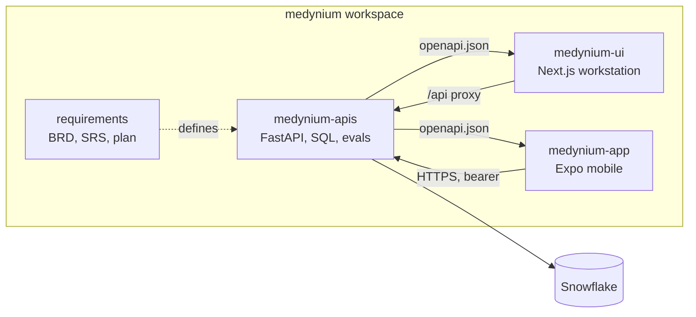

## 2. Containers and trust boundaries

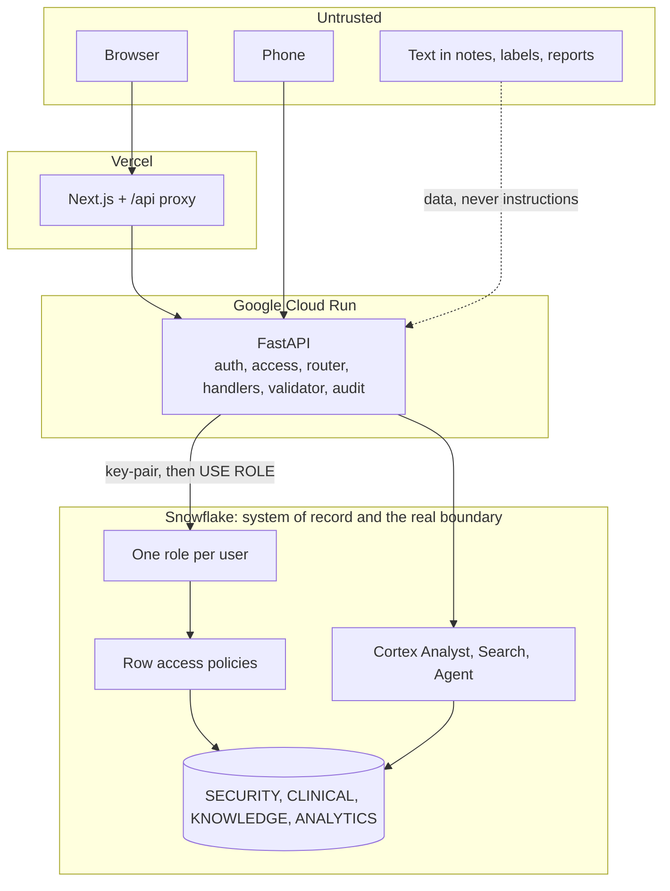

The UI and the router are not boundaries. The boundary is the database role plus the server checks that run on every route.

## 3. Sign-in, refresh and reuse detection

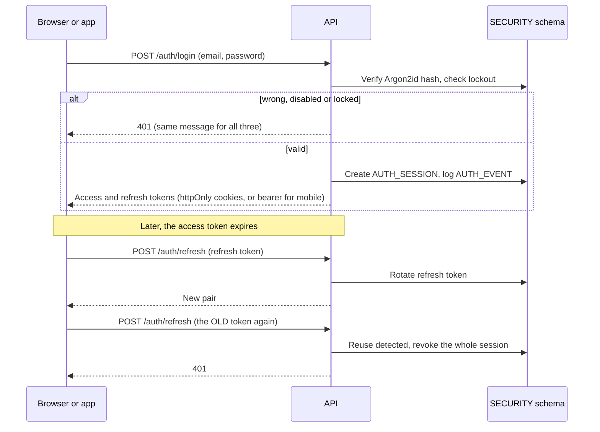

Five failed sign-ins lock the account for 15 minutes.

## 4. One request under the user's role

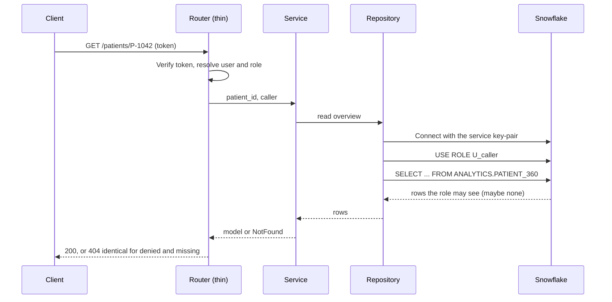

## 5. Assistant answer, end to end

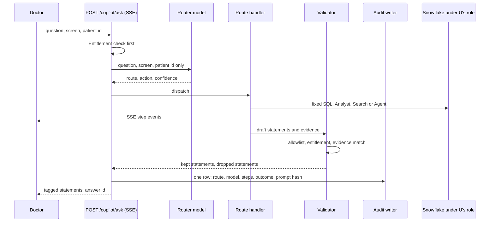

## 6. A proposal and its approval

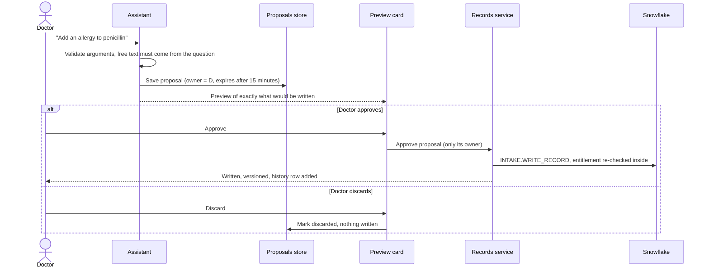

## 7. Report intake

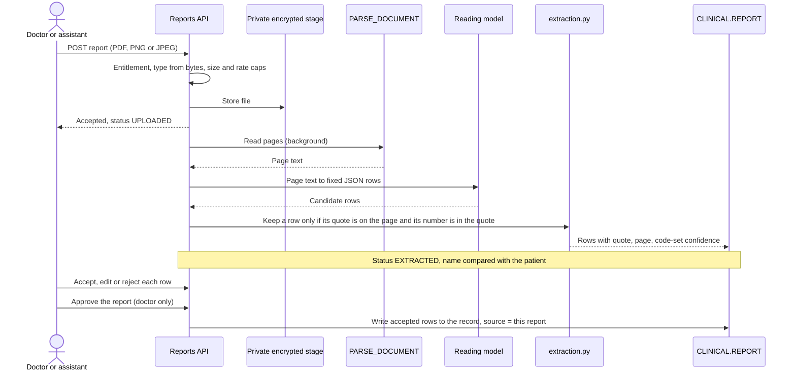

## 8. Finding lifecycle

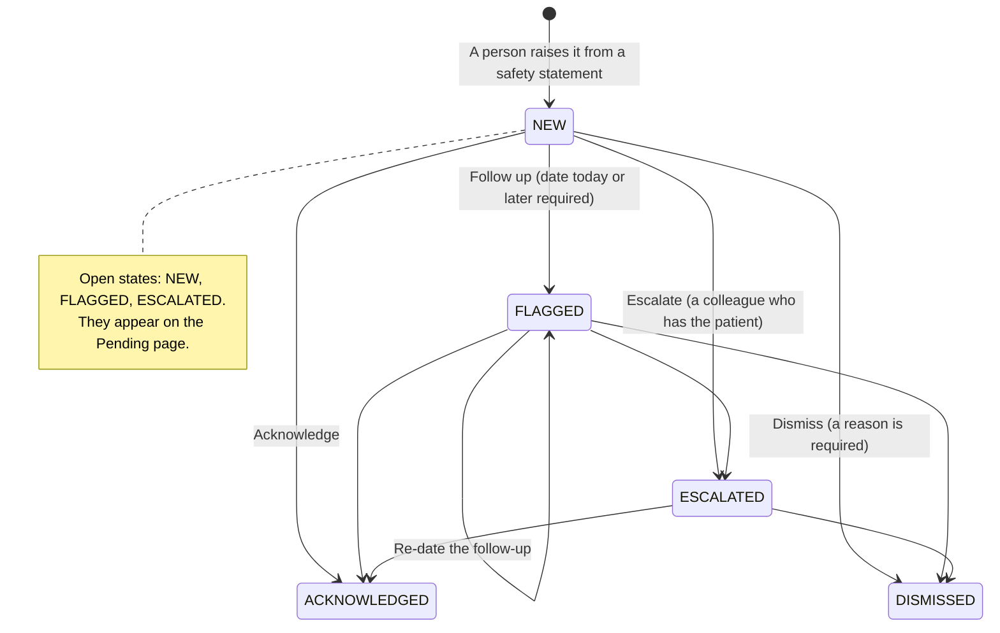

The rules live in `features/findings/rules.py`, as pure functions tested without a database. The diagram shows the usual paths. The code refuses a decision that is incomplete (no reason, no future date, no valid colleague) and a repeat of the same state, except re-dating a follow-up; it does not otherwise restrict which state follows which.

## 9. Report and row lifecycle

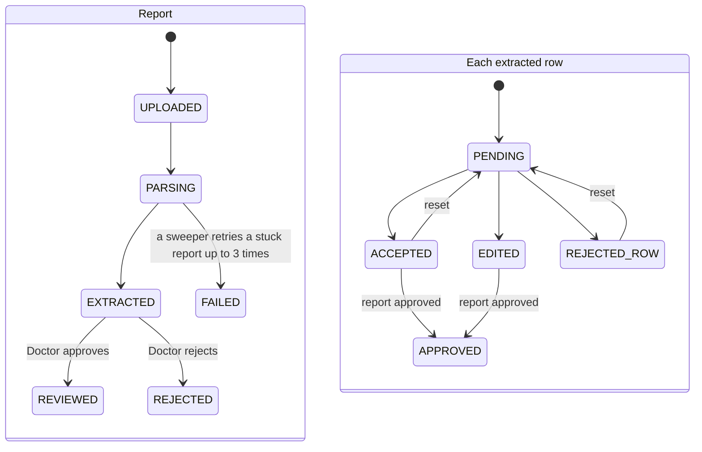

`REJECTED_ROW` stands for the row status `REJECTED`, renamed here so it does not clash with the report status.

## 10. Record write path

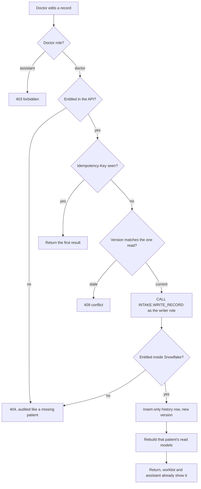

## 11. Data ingestion and build order

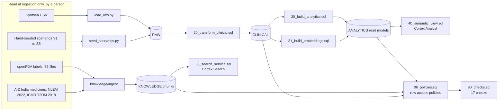

All steps are idempotent and can be re-run on a clean or populated schema.

## 12. Schemas and roles

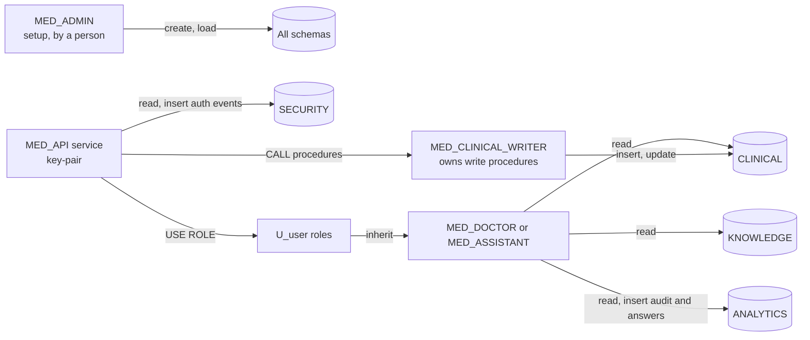

The runtime service identity has no privilege on patient tables. The writer role is reached only through procedures that re-check entitlement.

## 13. Findings, reports and history (ER)

The core ER diagram is in the [database README](../database/README.md#entity-relationships). This one adds the newer tables.

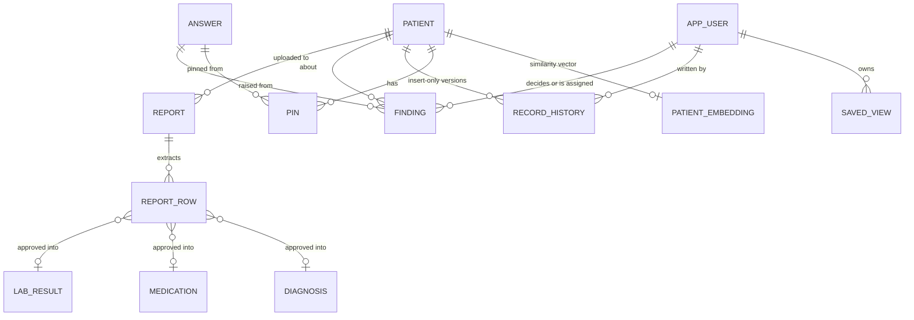

Table names in this diagram are logical. Exact names and columns are in the [data dictionary](../database/data-dictionary.md).

## 14. Evidence chain

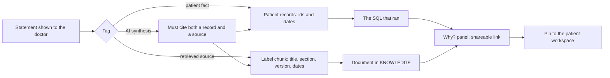

## 15. Statement validation

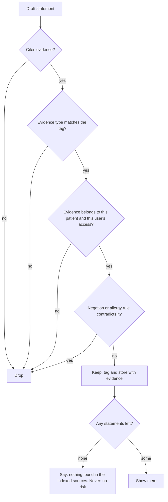

## 16. Delivery pipeline

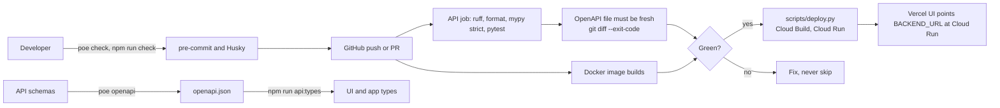

## 17. Mobile session and lock

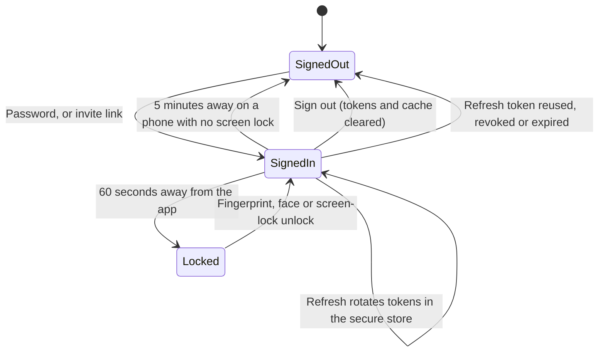

The lock is a local convenience on top of the server session, not a replacement for it. Tokens live in the secure store only. The query cache is memory-only and cleared on sign-out, and Android backups are disabled.

## 18. How the repos were built

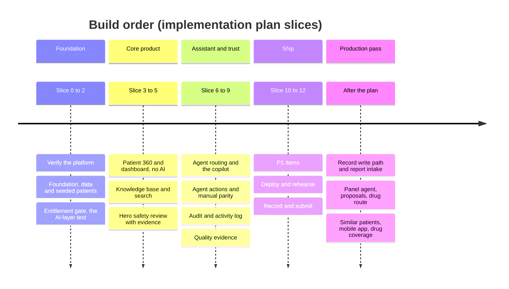

The slices are from the implementation plan; the last section is the later production pass. The authoritative order and done-when checks are in the [implementation plan](../requirements/Medynium_Implementation_Plan.md).
