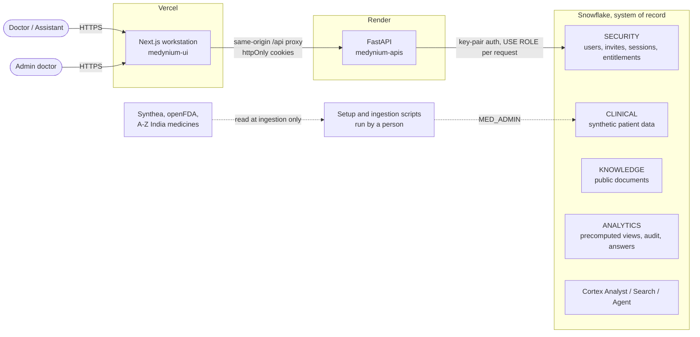
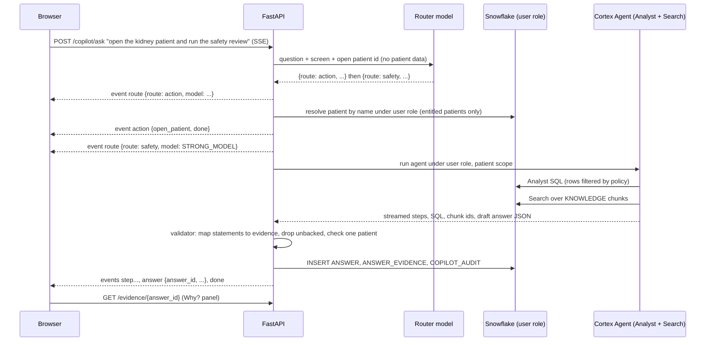

# Architecture overview

Status: **Draft for review.** Sources: BRD, SRS, implementation plan, and the decisions in [decisions.md](decisions.md). Where this differs from the SRS, the difference is called out and listed in [decisions.md](decisions.md#changes-to-the-srs).

## 1. What the system is

Medynium is a clinical workstation over a governed Patient 360 held in Snowflake, with an agent that answers questions about one patient and shows the evidence for every statement. Data is synthetic. Output is decision support only.

Three things carry the product's trust claim, so the architecture is organised around them:

1. **Access chain.** What a user cannot open in the app, the AI cannot retrieve for them either.
2. **Evidence chain.** Every answer statement links to a patient record or a source chunk, or the system says it found nothing.
3. **Closed action set.** The agent can do four things, enforced on the server.

## 2. System context



Notes:

- The browser only ever talks to the UI origin. `next.config.ts` proxies `/api/*` to the API, so cookies are first-party.
- Snowflake is the only datastore. There is no Postgres, Redis or vector store (see ADR-001).
- External data sources are read **at ingestion only**. No outside API is called at run time (NFR-12).
- CoCo CLI builds, tests and audits the stack. It is not in the answer path (PLT-05).

## 3. Components

| Component | Responsibility | Does not do |
| --- | --- | --- |
| **medynium-ui** (Next.js) | Dashboard, patient workspace, knowledge search, Why? panel, activity log, admin, agent panel. Renders streamed steps. | Talk to Snowflake; hold secrets; decide access. |
| **API: auth** | Login, refresh, logout, invite acceptance, password change; issues and verifies cookies. | Store plaintext secrets. |
| **API: access** | Resolves the caller, leases a Snowflake connection under the caller's role, checks entitlement, returns 404 for denied and missing alike. | Trust the router or the UI. |
| **API: data routes** | Dashboard, patients, timeline, labs, claims, notes, knowledge search. Plain SQL on precomputed tables. | Call a model. |
| **API: router** | Small model picks one of six routes for free text. Sees question, screen and patient ID only. | See patient records or document text; act as a security boundary. |
| **API: handlers** | `lookup`, `analyst`, `knowledge`, `safety`, `action`, `refuse` (see [ai-layer.md](ai-layer.md)). | Skip entitlement, allowlist or validation. |
| **API: validator** | Maps each answer statement to evidence of the matching type, drops unbacked statements, rejects SQL that touches another patient. | |
| **API: audit writer** | One writer used by every route and action, including denials. | |
| **Snowflake** | Row access policies, precomputed analytics, Cortex Analyst, Search and Agent, audit tables. | |
| **Setup scripts** | Create objects, load and localise data, build search service. Idempotent. Run by a person as `MED_ADMIN`. | Run in the deployed API. |

## 4. Request flows

### 4.1 Sign-in and an ordinary read

```mermaid
sequenceDiagram
  participant B as Browser
  participant U as Next.js (/api proxy)
  participant A as FastAPI
  participant S as Snowflake
  B->>U: POST /api/auth/login {email, password}
  U->>A: POST /auth/login
  A->>S: SELECT user by email (role MED_API, SECURITY.APP_USER)
  A->>A: verify argon2id hash, lockout check
  A->>S: INSERT AUTH_SESSION (refresh token hash), AUTH_EVENT
  A-->>B: 200 {user}; Set-Cookie med_access (15 min), med_refresh (7 d)
  B->>U: GET /api/patients/P-1042
  U->>A: GET /patients/P-1042 (cookies)
  A->>A: verify access JWT (no DB hit)
  A->>S: USE ROLE U_<user>; SELECT ... FROM ANALYTICS.PATIENT_360 WHERE patient_id = ?
  S-->>A: 0 or 1 row (row access policy applied)
  A-->>B: 200 overview, or 404 not_found (identical for denied and missing)
```

### 4.2 Hero flow: open a patient and run the safety review



### 4.3 Routing

`lookup`, `action` and `refuse` make no model call after routing; `knowledge` makes none either. Only `analyst` and `safety` reach a generating model. Details, the router contract and fallbacks are in [ai-layer.md](ai-layer.md).

## 5. Trust boundaries

| Boundary | Rule |
| --- | --- |
| Browser to UI origin | Cookies are `HttpOnly`, `Secure`, `SameSite=Lax`. Non-GET requests also need the `X-Medynium-Client: web` header. |
| UI to API | Server-to-server proxy only; the API is not meant to be called by browsers directly. |
| API to Snowflake | One service identity authenticates by key pair, then assumes a per-user role for the request. The service identity has no direct privilege on patient tables. |
| Router | Untrusted for security. Its output is validated and every route re-runs entitlement, allowlist and evidence checks. |
| Source text | Labels and notes are data. Instructions inside them are ignored (AI-05). |
| Model output | Untrusted until the validator accepts it. |

Full access model: [security-and-access.md](security-and-access.md).

## 6. Data architecture in one view

| Schema | Holds | Patient data? | Row access policy |
| --- | --- | --- | --- |
| `RAW` | Untouched Synthea CSV and source JSON | Yes (synthetic) | Setup roles only |
| `CLINICAL` | Normalised patient data, localised for India | Yes | Yes |
| `KNOWLEDGE` | Drug labels and Indian reference documents, chunked | **No**, public only (SEC-04) | No |
| `SECURITY` | Users, invites, sessions, entitlements, auth events, policies | No patient data | Admin procedures only |
| `ANALYTICS` | Precomputed Patient 360, timeline, utilisation, worklist; answers, evidence, audit, pins, saved views | Yes | Yes |

Column-level detail: [../database/README.md](../database/README.md).

## 7. Deployment

| Piece | Host | Notes |
| --- | --- | --- |
| UI | Vercel | `BACKEND_URL` set to the API. Proxies `/api/*`. |
| API | Render web service, Docker, always on | Secrets in the Render dashboard. `/health` is the health check. |
| Snowflake | Trial account `PSYMVEK-AI12714`, region Azure Central India | XSMALL warehouse `MEDYNIUM_WH`, auto-suspend 60 s, resource monitor 50% notify and 80% suspend. |
| CI | GitHub Actions | Lint, types, tests, OpenAPI freshness, Docker build. |

SSE through the Vercel proxy must be verified early (risk R-3 below). Fallback: serve the API on a custom domain sharing a parent with the UI, and call it directly with CORS and a domain cookie.

## 8. Cross-cutting concerns

| Concern | Approach |
| --- | --- |
| **Logging** | Structured JSON in non-local environments. Never log passwords, tokens, keys, patient names or question text at INFO. Patient IDs may be logged; they are synthetic. |
| **Config** | Environment variables read through one settings class (`core/config.py`). |
| **Errors** | `{error, message}` contract, one handler. See [../api/README.md](../api/README.md#errors). |
| **Time** | Stored and transmitted as UTC; displayed in IST (`Asia/Kolkata`). Dates without times are plain dates. |
| **Money** | Stored as INR with two decimals; the Synthea USD to INR rate is fixed and recorded in [../database/data-loading.md](../database/data-loading.md). |
| **Idempotency** | Setup scripts and loaders can be re-run on a clean or populated schema. |
| **Resilience** | A failed agent call returns `agent_unavailable`; Patient 360 and all manual screens keep working (NFR-09, NFR-13). |
| **Observability** | `/health` (public, minimal) and `/health/details` (admin) report the database, warehouse, Cortex objects and audit-write status. |

## 9. Risks that shape the design

| # | Risk | Why it matters | Early check |
| --- | --- | --- | --- |
| R-1 | Per-user role in a shared service session is not honoured by row access policies or by Cortex REST calls | Whole access chain depends on it | Slice 2 spike (see [security-and-access.md](security-and-access.md#validation-spike)) |
| R-2 | Snowflake as the only store makes the first request after idle slow (warehouse resume) | Login and first page load feel slow | Time cold login; keep auth lookups on tiny tables; optional pre-demo warm-up call |
| R-3 | SSE is buffered or cut by the Vercel proxy | Streamed steps are part of the demo | Deploy a stub SSE route in the first deploy |
| R-4 | Agent slower than 20 s | NFR-01, G5 | Time S1 in Slice 5; fewer chunks, shorter instructions |
| R-5 | Cortex Agent cannot take a per-user role | G4 for the Copilot | Fallback: API runs SQL under the user's role and passes only permitted rows to the model |
