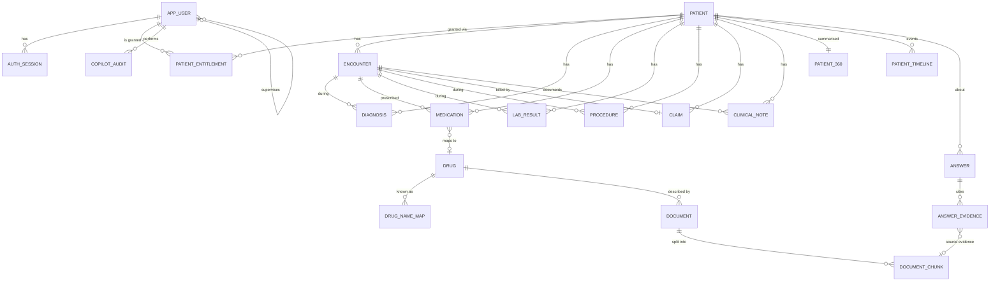

# Database

Status: **Draft for review.** Snowflake is the system of record. Source: SRS section 5, implementation plan Slices 1 to 3, the Synthea CSV layout (checked against a generated sample), and the decisions in [../architecture/decisions.md](../architecture/decisions.md).

| Document | Covers |
| --- | --- |
| [data-dictionary.md](data-dictionary.md) | Every table with each field described, plus the claims map |
| [security.md](security.md) | `SECURITY`: users, invites, sessions, entitlements, auth events, policy, procedures |
| [clinical.md](clinical.md) | `RAW` and `CLINICAL`: patient data, Synthea mapping |
| [knowledge.md](knowledge.md) | `KNOWLEDGE`: documents, chunks, drug map, search service |
| [analytics.md](analytics.md) | `ANALYTICS`: precomputed tables, answers, evidence, audit, pins, saved views |
| [data-loading.md](data-loading.md) | Pipeline, India localisation, seeded scenarios S1 to S5, checks |

## Environment

| Object | Name | Notes |
| --- | --- | --- |
| Account | `PSYMVEK-AI12714` | Trial, Azure Central India |
| Database | `MEDYNIUM` | Already created (holds the authentication policy used to bootstrap) |
| Warehouse | `MEDYNIUM_WH` | XSMALL, auto-suspend 60 s, resource monitor 50% notify, 80% suspend |
| Schemas | `RAW`, `CLINICAL`, `KNOWLEDGE`, `SECURITY`, `ANALYTICS` | |

## Roles

| Role | Purpose | Key privileges |
| --- | --- | --- |
| `MED_ADMIN` | Setup only, run by a person | Create objects, load data. Never used by the deployed API. |
| `MED_API` | Service identity for the API (key-pair user `MED_API_SVC`) | `USE ROLE` on every `U_*`; read `SECURITY.APP_USER`, `AUTH_SESSION`, `USER_INVITE`; insert `AUTH_EVENT`; execute provisioning procedures. No privilege on patient tables. |
| `MED_DOCTOR`, `MED_ASSISTANT` | Base roles inherited by `U_*` | Read `ANALYTICS`, `CLINICAL`, `KNOWLEDGE`; insert `COPILOT_AUDIT`, `ANSWER`, `ANSWER_EVIDENCE`, `PIN`, `SAVED_VIEW`; no write to `CLINICAL` |
| `U_<user_id>` | One per app user | Inherits its base role; sees only entitled patients |
| `MED_AGENT_READ` | CoCo skills, golden-run job | Read-only, scoped |

## Entity relationships

## Conventions

| Topic | Rule |
| --- | --- |
| Names | Upper snake case. Primary key `<ENTITY>_ID`. |
| Types | `VARCHAR` ids, `DATE` for dates, `TIMESTAMP_NTZ` in **UTC** for instants, `NUMBER(12,2)` for INR, `BOOLEAN` flags, `VARIANT` for structured JSON. |
| Ids | Readable and stable: `P-1042`, `ENC-20931`, `DX-3301`, `RX-88231`, `LAB-77120`, `PRC-5521`, `CLM-1024`, `DOC-ED-20931`. The Synthea UUID is kept in `SOURCE_ID`. Generated deterministically at load so reruns produce the same ids. |
| Constraints | Snowflake does not enforce foreign keys; they are declared for documentation and checked by load scripts. |
| Patient scope | Every table with `PATIENT_ID` carries the row access policy. A test fails if one does not (see [security.md](security.md#policy-coverage-test)). |
| Money | INR, converted from Synthea USD at a fixed rate, see [data-loading.md](data-loading.md#localisation). |
| PII | Synthea SSN, driver's licence, passport and maiden name are **not loaded**. All patient data is synthetic. |
| Idempotency | `CREATE OR REPLACE` for derived tables; `MERGE` for seeds; each script safe to rerun. |

## Where each screen and endpoint reads from

| Screen or endpoint | Source |
| --- | --- |
| Worklist, dashboard | `ANALYTICS.DASHBOARD_WORKLIST`, `PATIENT_LAB_LATEST`, `UTILIZATION` |
| Patient overview | `ANALYTICS.PATIENT_360`, `CURRENT_MEDICATIONS`, `PATIENT_LAB_LATEST` |
| Timeline, lab trend | `ANALYTICS.PATIENT_TIMELINE`, `CLINICAL.LAB_RESULT` |
| Claims | `CLINICAL.CLAIM` joined to `ENCOUNTER`; totals from `ANALYTICS.UTILIZATION` |
| Notes | `CLINICAL.CLINICAL_NOTE` |
| Knowledge search | Cortex Search over `KNOWLEDGE.DOCUMENT_CHUNK` |
| Why? panel | `ANALYTICS.ANSWER`, `ANSWER_EVIDENCE` |
| Activity log | `ANALYTICS.COPILOT_AUDIT` |
| Sign-in, admin users | `SECURITY.*` |
