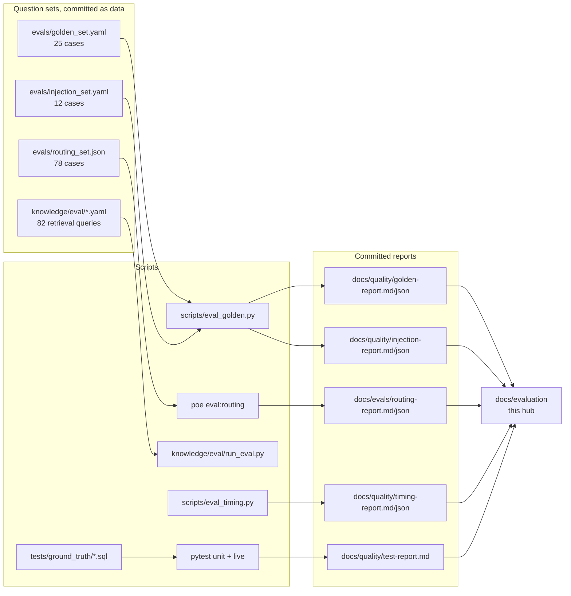

# Evaluation hub

The detailed numbers behind every claim in the READMEs. The READMEs carry a short summary and link here; this folder holds the tables, charts and method.

> **Synthetic data only. Decision support, not diagnosis.** Every figure comes from a run against the synthetic demo data. None of it is a clinical-accuracy claim.

## Read in this order

| # | Document | Question it answers |
| --- | --- | --- |
| 1 | [results.md](results.md) | What passed, what failed, how many cases, across all three repos |
| 2 | [feature-coverage.md](feature-coverage.md) | For each feature: which endpoints, which tests, which eval proves it, and how well |
| 3 | [security-evaluation.md](security-evaluation.md) | Do the access and safety promises hold, and how was each one attacked |
| 4 | [performance-and-cost.md](performance-and-cost.md) | How fast is it, against which targets, and what did it cost to run |
| 5 | [impact-and-use-cases.md](impact-and-use-cases.md) | Why it matters: the clinical workflow, real-world scenarios, who benefits |
| 6 | [../architecture/diagrams.md](../architecture/diagrams.md) | The diagram gallery: sequence, state, ER, deployment, data flow |

## How the evidence is organised

## Method in one page

| Principle | What it means here |
| --- | --- |
| **Live, not mocked** | Golden, injection, routing, retrieval and live integration runs hit the real Snowflake account as the seeded users. Unit tests are the only offline layer |
| **Numbers are compared with SQL** | Every number the product shows is checked against an independent query in [tests/ground_truth/](../../tests/ground_truth/README.md), run under the user's own role |
| **Server rules do not trust the model** | Allowlist, entitlement and evidence checks are unit-tested with the router forced wrong, so a model slip cannot become a breach |
| **Failures stay visible** | Failed cases are listed in the reports and in [results.md](results.md#8-failures-and-open-issues), not removed or re-scored silently |
| **Changed expectations are recorded** | When a pass criterion was changed after seeing a run, the change is written in [test-report.md](../quality/test-report.md#notes-on-how-the-sets-are-scored) |

## Where the figures come from, and how fresh they are

The committed reports were produced at different times. The most recent artifact wins; older figures are kept in [test-report.md](../quality/test-report.md) as history.

| Figure | Source artifact | Generated | Note |
| --- | --- | --- | --- |
| Golden set 18 of 19 | [golden-report.json](../quality/golden-report.json) | 2026-10-04 12:35 UTC | The run covers 19 of the 25 cases now defined (G20 to G25 were added after it). An earlier run of the same 19 passed 19 of 19; the failure is G09, model variance |
| Injection set 12 of 12 | [injection-report.json](../quality/injection-report.json) | 2026-10-04 12:36 UTC | |
| Routing 72 of 73 | [routing-report.json](../evals/routing-report.json) | 2026-10-04 | The set has since grown to 78 cases; the figure is for the 73 in the run |
| Retrieval recall@3, recall@5 and MRR 1.0, negatives answered honestly | `knowledge/eval/run_eval.py` | 2026-10-04 | Two files: 74 positive and 8 negative queries (82 in all), as recorded in the [test report](../quality/test-report.md#production-readiness-run-2026-10-04-live-account-demo_as_of_date2026-10-02-one-test-file-per-process) |
| Timing | [timing-report.json](../quality/timing-report.json) | 2026-10-03 | Service layer, no HTTP; add 50 to 100 ms |
| API unit and architecture tests | `pytest tests --ignore=tests/integration` | **2026-10-06** | 250 passed, re-run for this hub |
| UI tests | `npx vitest run` in `medynium-ui` | **2026-10-06** | 145 passed in 29 files |
| Mobile tests | `npx jest` in `medynium-app` | **2026-10-06** | 59 passed in 16 suites |

The older README figures (19 of 19 golden, 44 of 47 routing) were true of the earlier runs recorded in the test report. They are updated to the figures above wherever they appeared.

## Refreshing this folder

1. Re-run the evals (commands are in each document and in the [API README](../../README.md#quality-and-evaluation)).
2. Copy the new totals into [results.md](results.md) and the summary tables in the three READMEs.
3. Keep the "Generated" date next to every figure.
