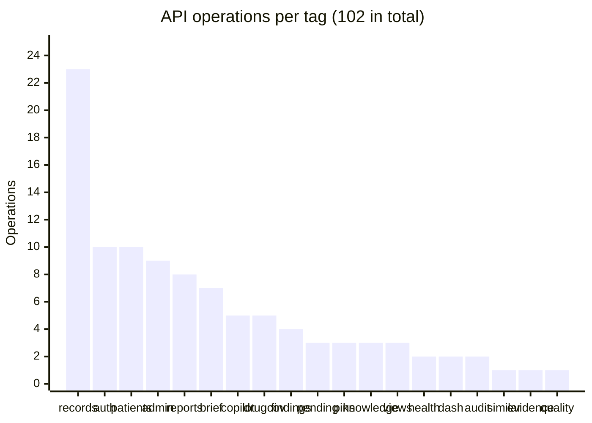

# Feature coverage

For every feature: how many endpoints it exposes, which tests and evals prove it, and where the proof is thin. Endpoint counts are read from [docs/api/openapi.json](../api/openapi.json) (102 operations on 89 paths, 164 schemas).

## 1. Surface area

| Method | Operations |
| --- | --- |
| GET | 50 |
| POST | 38 |
| PUT | 9 |
| PATCH | 3 |
| DELETE | 2 |

| Layer | Size |
| --- | --- |
| Backend feature folders | 20, each with a README card |
| Backend source | about 16,600 lines of Python under `src/`, files capped at 300 lines by an architecture test |
| Snowflake setup | 25 numbered, idempotent SQL files |
| Web workstation | 15 pages, about 30,000 lines of TypeScript |
| Mobile app | 13 feature folders, about 21,000 lines of TypeScript |

## 2. Feature by feature

Legend: **Unit** is an offline test, **Live** runs against Snowflake as the seeded users, **Eval** is a question set. A dash means nothing of that kind exists for the feature.

| Feature | Ops | Unit | Live | Eval | Web | Mobile |
| --- | --- | --- | --- | --- | --- | --- |
| **Patient 360** (overview, medications, labs, timeline, claims, notes) | 10 | `test_product_rules`, `test_doctors_and_summary` | `test_patients`, `test_ground_truth`, `test_workspace` | Ground truth SQL, golden G04 to G06 | Patient workspace, 9 tabs | Segmented tabs, lab chart |
| **Dashboard** | 2 | `test_intel_rules` | `test_dashboard` | Ground truth (worklist size) | Dashboard | Home |
| **Patient brief** (changes, gaps, attention) | 7 | `test_intel_rules` | `test_brief` (11) | Golden G05 | Overview brief | Overview brief |
| **Clinical assistant** (router and handlers) | 5 | `test_agent_compose`, `test_tool_registry`, `test_panel`, `test_drug_route`, `test_complete_retry` | `test_copilot` (21), `test_agent` | Golden (19), routing (73) | Agent panel, command bar | Ask tab |
| **Safety review** (Cortex Agent) | in copilot | `test_validator`, `test_negation_guard`, `test_allergy_rule` | `test_copilot` | Golden hero G01 to G03, honest-gap G07 and G09 | Safety tab | Safety tab |
| **Evidence (Why?)** and pins | 1 + 3 | `test_validator` | `test_copilot`, `test_workspace` | Golden (evidence checks) | Why? panel | Why? sheet |
| **Findings** (clinician decisions) | 4 | `test_findings` | none yet | none | Findings on Safety tab | open findings appear in Pending only |
| **Pending work** | 3 | `test_intel_rules` | `test_pending` (14) | Golden G16 to G18 | Pending page | Pending tab |
| **Knowledge search** | 3 | `test_knowledge_names` | `test_knowledge` (13) | Retrieval (82 queries), golden G13 to G15 | Knowledge page | Knowledge screen |
| **Drug coverage** (gaps, requests, admin) | 5 | `test_drug_route` | `test_drug_coverage` (8) | Retrieval negatives | Admin coverage | not surfaced |
| **Reports intake** | 8 | `test_reports_extraction` | `test_reports` (13), `test_report_questions` | Sample reports with `expected.json` | Reports tab | Reports tab |
| **Records** (write path, history) | 23 | `test_records` | `test_records` (11) | Ground truth after writes | Add, edit, archive | not surfaced |
| **Proposals** (assistant prepares, doctor approves) | in copilot | `test_proposals` | `test_proposals_live` (5) | Routing `propose` 7 of 7 | Proposal cards | Proposal cards |
| **Similar patients** | 1 | `test_similar` | `test_similar` (8) | Proxy precision@5 0.824 | Similar tab | Similar tab |
| **Saved views** | 3 | `test_product_rules` (share allowlist) | `test_workspace` | none | Saved views | none found in the app source |
| **Audit** | 2 | `test_ai_metrics` | `test_copilot`, `test_logs_are_clean` | Stream equals audit row (Q-S5) | Activity | Activity |
| **Auth** (login, refresh, invites, lockout) | 10 | `test_security_primitives`, `test_mobile_bearer`, `test_email_otp_paging` | `test_auth_flow` (6) | none | Sign-in, invite | Sign-in, invite |
| **Admin** (users, entitlements) | 9 | `test_last_admin_guard` | `test_admin_lifecycle` (6) | none | Admin | Admin (no entitlements) |
| **Quality** (golden-run, AI metrics) | 1 | `test_ai_metrics` | `test_quality` | the evals themselves | Admin health | Admin |
| **Health** | 2 | `test_api_contract` | `test_logs_are_clean` | none | Admin health | Admin |

## 3. Requirement traceability

Requirement IDs come from the [SRS](../requirements/Medynium_SRS.md). Each row names the check that proves it.

| ID | Requirement | Proven by |
| --- | --- | --- |
| SEC-02, SEC-03 | Every request runs under the user's own role | `test_access_sql` (S3 invisible in seven tables), role-leakage test (200 alternating requests, 8 threads) |
| SEC-05 | Denied equals missing, no patient id in errors | `test_denied_is_byte_identical_to_missing` (eight paths), latency within 0.25 s |
| SEC-06 | No runtime path uses `MED_ADMIN` | `test_architecture` scans the source |
| SEC-12 | Closed action set, refusals audited | `test_an_unlisted_action_is_refused_and_audited`, router-forced-wrong tests |
| AI-03, AI-05 | Text in notes, labels and reports is data | Injection set (12 of 12), `test_validator` |
| FR-22 spirit | A person decides, nothing automatic | `test_findings`, `test_proposals`, report approval tests |
| NFR-12 | No outside API at run time | Architecture: external data read at ingestion only |
| PLT-01 | Feature folders are self-contained | `test_architecture`: no cross-feature imports, only repositories touch the driver, 300-line cap |

## 4. Where coverage is thin

| Gap | Why it matters | Next step |
| --- | --- | --- |
| **Findings has no live test** | The decision rules are unit-tested, but the row access policy on `ANALYTICS.FINDING` is not exercised end to end | Add a live test for visibility to a colleague and invisibility to others |
| **Saved views, health and admin have no eval** | Low risk, but nothing measures them beyond tests | Acceptable for now |
| **Mobile has no live test** | The 59 Jest tests mock the API boundary; it relies on the API's own live suite | A device smoke run (see `medynium-app/SMOKE_TESTS.md`) |
| **Image OCR tried on one clean PNG** | Scanned reports vary a lot | Add a few noisy samples to `data/sample_reports/` |
| **Similar patients has no clinician labels** | Proxy precision only | Needs clinician review of a sample |
| **Label-text injection not exercised** | The index is shared; planting a payload would pollute it | Test against a private index |
