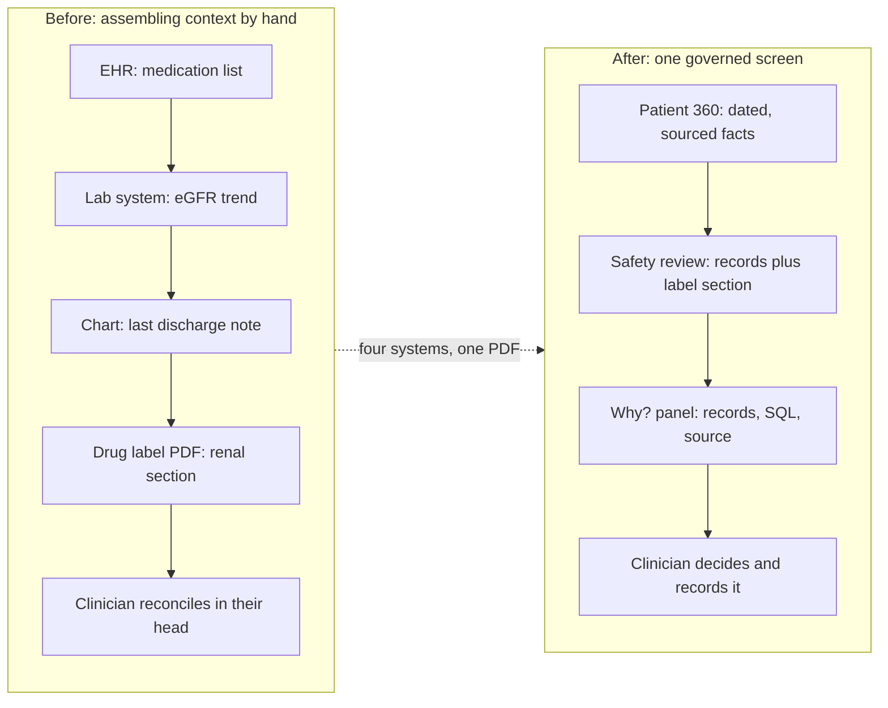
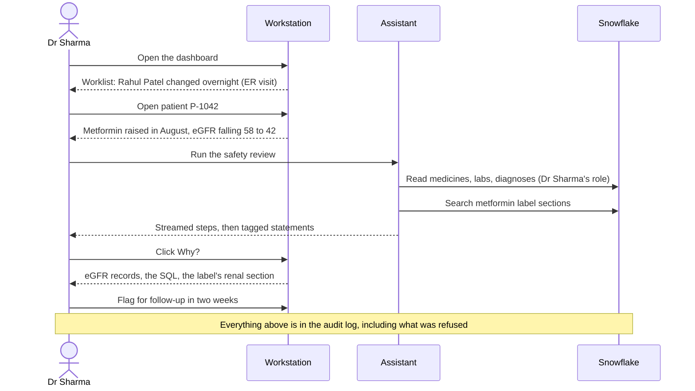
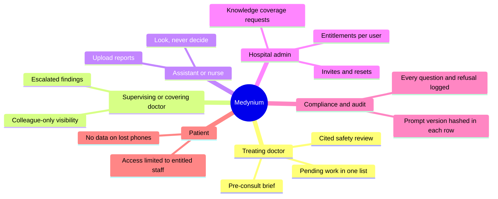
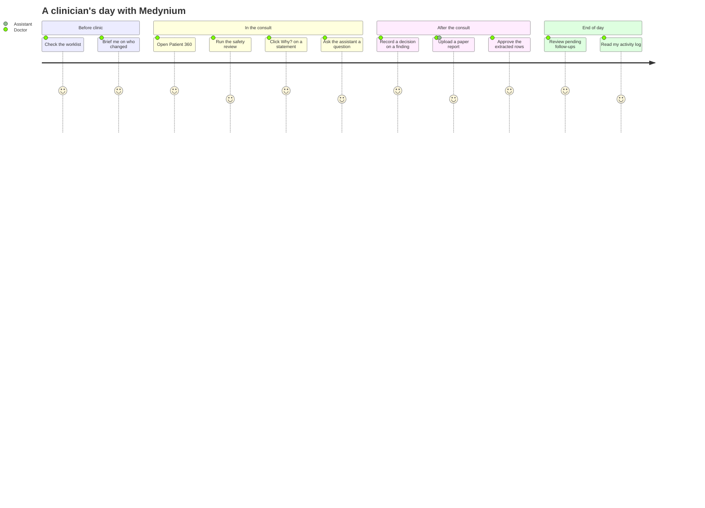

# Impact and real-world use cases

Why Medynium exists, who it helps, and what changes in a working day. Everything here is argued from what the product does and what was measured. **No deployment or user study has been run, so there are no claims of hours saved or outcomes improved.** Where a number appears it comes from [results.md](results.md) or [performance-and-cost.md](performance-and-cost.md).

## 1. The problem in one workflow

A clinician has minutes per patient, and the facts live in different places.

| Step | Before | With Medynium |
| --- | --- | --- |
| Find what changed overnight | Open each chart | Dashboard worklist with change flags, about 1 s, no model |
| Check a medicine against kidney function | Read the label, read the labs, compare | One cited safety review, 15 to 40 s, streamed |
| Trust the answer | Cannot see where it came from | **Why?** shows the records, the SQL and the label section |
| No label for the drug | Silence, which reads as "fine" | An honest gap and a request for coverage |
| Record a decision | Free text somewhere | A finding: acknowledge, follow up, escalate or dismiss, with the server enforcing the rules |

## 2. The 60-second story, as a sequence

The synthetic hero patient has a documented history that makes the renal consideration real: a rising metformin dose, an eGFR falling from 58 to 42 across four readings, and stage 3b chronic kidney disease.

## 3. Who benefits

| Persona | What they get | Governed by |
| --- | --- | --- |
| **Treating doctor** | Worklist, brief, cited safety review, label search, decisions on findings | Own role in Snowflake |
| **Covering doctor** | Findings escalated to them, visible only to people who also have the patient | Row access on `ANALYTICS.FINDING` |
| **Assistant or nurse** | Upload reports, search, look at records they are entitled to | Cannot decide, approve or write |
| **Admin doctor** | Users, invitations, password resets, per-user patient access, coverage requests | Admin pages only for admin doctors |
| **Compliance reviewer** | A readable log of every question, action, refusal and denial | One audit writer for every route |
| **Patient (indirectly)** | Their record is reachable only by entitled staff, and a denied lookup does not even confirm they exist | Denied equals missing |

## 4. Real-world use cases

Each case names the Medynium feature that serves it and what the evidence shows.

### 4.1 Pre-consult review in a busy outpatient clinic

A doctor with a full list opens the dashboard and sees who changed since the last visit, then opens a patient and reads the brief: what changed (previous visit, 90 days, one year) and what is missing. **Served by** Dashboard, brief, pending work. **Evidence:** data screens p50 about 1 s with no model call ([timing](performance-and-cost.md#1-latency-against-target)); brief rules are plain code with unit tests (`test_intel_rules`).

### 4.2 Medicine safety check against kidney function

The flagship case. A patient on metformin with falling eGFR: the review connects the lab trend to the exact label section, tags each statement as a patient fact, a retrieved source or an AI synthesis, and drops anything it cannot back. **Served by** Safety review, Why?. **Evidence:** 3 of 3 hero cases, 12 of 12 across repeated phrasings, retrieval recall@5 of 1.0 on 74 positive queries.

### 4.3 Discharge and emergency follow-up

A patient who attended the emergency department last night should not be forgotten. Pending work lists open findings, due follow-ups, unreviewed abnormal labs and recent emergency visits, most urgent first. The assistant uses the same list, so the screen and the chat cannot disagree. **Served by** Pending, Findings. **Evidence:** `test_pending` (14 live tests); golden G16 to G18.

### 4.4 Medicines without a label in India

A clinician types an Indian brand name, with a typo. The search resolves it to the generic drug and returns a cited section. If no label is indexed, the answer is an honest gap with nearby suggestions, and the clinician can request coverage which an admin reviews. **Served by** Knowledge search, drug coverage. **Evidence:** brand queries in both retrieval sets, 8 of 8 negatives answered honestly, a corpus that includes the National List of Essential Medicines (2022) and the ICMR T2DM guideline (2018). **Limit:** most labels are US labelling.

### 4.5 Paper reports to structured records

A patient arrives with a printed lab report or a prescription photo. Upload it; rows are extracted with the exact quoted words and page, a name mismatch blocks approval, and nothing reaches the record until a doctor accepts, edits or rejects each row. **Served by** Reports intake. **Evidence:** `test_reports_extraction`, 13 live tests, sample reports with expected output. **Limit:** English only, legible print, handwriting unsupported, image OCR tried on one clean PNG.

### 4.6 Several doctors, one hospital, strict privacy

Doctor A cannot open Doctor B's patient, and the assistant cannot either. A denied patient looks exactly like one that does not exist, so even probing reveals nothing. **Served by** Row access policies, per-request role, denied equals missing. **Evidence:** isolation tests, 200-request role-leakage test, 17 database checks.

### 4.7 Ward rounds and corridor consults on a phone

The same Patient 360 and the same Why? evidence on a phone, with no patient data stored on the device, backups disabled and an auto-lock. **Served by** `medynium-app`. **Evidence:** 59 Jest tests; build is Android only; TalkBack and on-device checks are still to do.

### 4.8 Audit and accountability

"What did the assistant do for me yesterday?" answered from the user's own activity log; "why did it say that?" answered by the evidence. Prompt versions are hashed into each row so a change in behaviour can be traced to a change in a prompt. **Served by** Audit, Activity. **Evidence:** stream equals audit row test; logs hold no secrets, names or question text.

### 4.9 Insurance and claims context in INR

Claims are in rupees with billed against approved, and utilisation (visits, procedures, billed, approved, trailing 365 days) is shown on the patient and the dashboard. **Served by** Patient 360 claims, dashboard. **Evidence:** ground-truth SQL for utilisation totals.

### 4.10 Finding patients like this one

For a complex patient, the closest of the clinician's own patients, explained by shared diagnoses, medicines and abnormal results, never padded with unrelated ones. **Served by** Similar patients. **Evidence:** proxy precision at 5 of 0.824. **Limit:** a proxy, not clinical truth.

## 5. Where it fits in the care pathway

Satisfaction scores in a journey chart are the authors' design intent, not survey data. Scores of 4 mark the steps that wait on a model call.

## 6. Impact, in plain terms

| Outcome | Why it matters | How we know |
| --- | --- | --- |
| **Less hunting, more looking** | Context assembly is the part of a consult that a computer should do | Data screens in about 1 s; four systems and a PDF replaced by one screen |
| **AI a clinician can check** | An unverifiable answer cannot be used in care | Every statement tagged and linked; unbacked statements dropped; 12 of 12 injection cases |
| **No false reassurance** | The most dangerous clinical-AI failure is "nothing found" read as "safe" | Honest-gap rule, 8 of 8 negative retrieval queries; **one intermittent miss (G09) is open and disclosed** |
| **Governance that binds the AI** | A model that can be talked into crossing a boundary is a privacy incident | Row access in the database, denied equals missing, router forced wrong in tests |
| **One platform, small footprint** | Fewer systems to secure, sync and pay for | Snowflake only: no Postgres, Redis or vector store; a full timed run costs 0.02 credits |
| **Fit for India** | Tools built for US labels miss local practice | Brand-name resolution, INR claims, NLEM and ICMR sources, synthetic patients across Indian cities |

## 7. What would make these claims stronger

1. A usability study with real clinicians on the synthetic data, measuring time to a decision.
2. Clinician-labelled relevance for similar patients and for safety statements.
3. A wider label corpus, including Indian regulatory labelling.
4. The code rule that closes G09.
5. A hero p50 under 20 s (today 24.1 s).

## 8. Limits to keep in view

- **Synthetic data only.** No real patient has been involved.
- **Decision support, not diagnosis.** The assistant refuses to diagnose, and a prescribing question is answered from label text, never as an instruction.
- **Not a certified medical device**, and not reviewed by any regulator.
- **English only** for report extraction.
