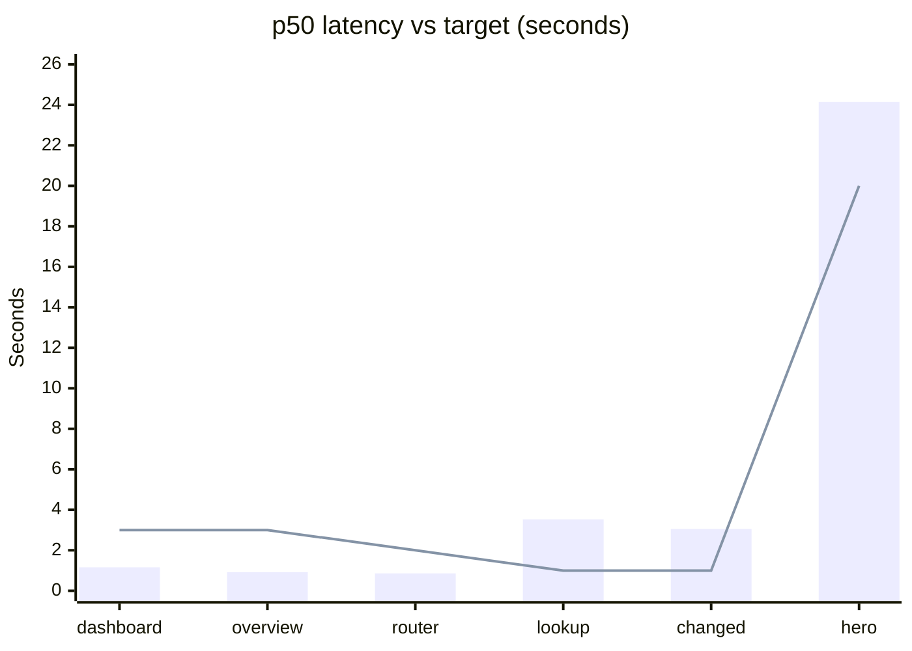
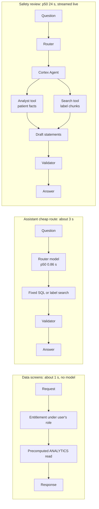
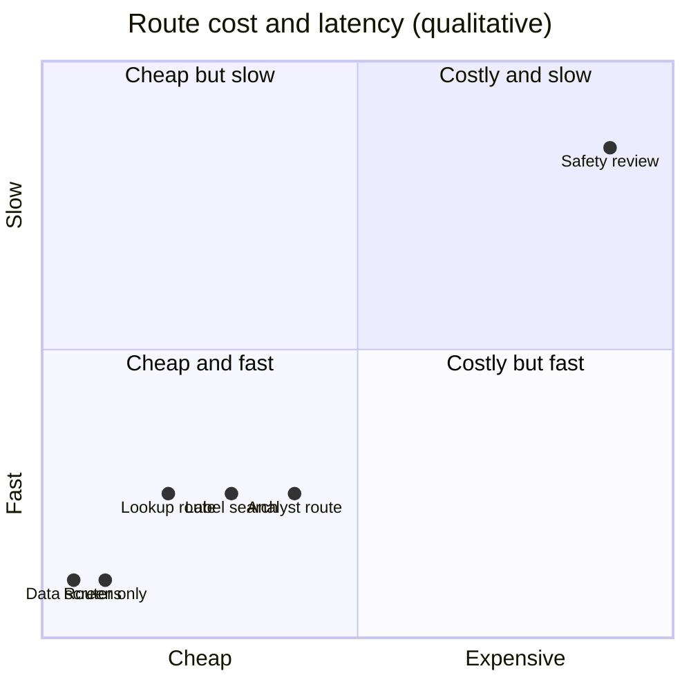

# Performance and cost

Measured at the service layer as the demo doctor on 2026-10-03, against the real Snowflake trial account (no HTTP, so add roughly 50 to 100 ms through the API). Source: [timing-report.json](../quality/timing-report.json), produced by `scripts/eval_timing.py`.

## 1. Latency against target

| Measure | Runs | Failed | Cold s | p50 s | p95 s | Max s | p50 target s | Within target |
| --- | --- | --- | --- | --- | --- | --- | --- | --- |
| Dashboard data | 20 | 0 | 1.59 | 1.16 | 1.98 | 1.98 | 3 | yes |
| Patient overview | 20 | 0 | 1.25 | 0.92 | 1.61 | 1.61 | 3 | yes |
| Router decision only | 10 | 0 | 1.94 | 0.86 | 1.94 | 1.94 | 2 | yes |
| Lookup route (current medicines) | 20 | 0 | 3.36 | 3.53 | 15.06 | 15.06 | 1 | **no** |
| Changed route (what changed) | 20 | 0 | 2.64 | 3.05 | 5.91 | 5.91 | 1 | **no** |
| Safety review through the assistant (hero) | 8 | 0 | 27.14 | 24.14 | 39.19 | 39.19 | 20 | **no** |

No run failed. Three of six measures meet their targets; the three that do not are the ones that involve a model call.



The bar is the measured p50 and the line is the target. Where the bar is above the line the target is missed (lookup, changed and hero).

## 2. Where the time goes



| Design choice | Effect |
| --- | --- |
| Patient 360 is **precomputed** into `ANALYTICS` read models | Data screens need no model and answer in about a second |
| The **router is a small model** (`llama3.1-8b`) | A routing decision costs under a second |
| Cheap routes **skip the strong model** | Fixed SQL and label search never pay for the strong model |
| The strong model is used **only when records and documents must be combined** | The expensive path is the minority of traffic |
| Answers **stream steps over SSE** | The user sees progress during a 15 to 40 s review instead of a spinner |

## 3. What the user sees during the hero run

```mermaid
gantt
  title Safety review as the user sees it (illustrative, about 24 s)
  dateFormat  s
  axisFormat  %S s
  section Assistant
  Routing                         :done, a1, 0, 1s
  Reading the patient's records   :done, a2, 1, 8s
  Searching drug labels           :done, a3, 9, 7s
  Drafting and validating         :done, a4, 16, 6s
  Answer with Why? links          :milestone, a5, 24, 0s
```



The phase lengths are illustrative: the real split varies with Cortex latency. What is measured is the total (p50 24.14 s, p95 39.19 s, range 13 to 53 s across runs recorded in the test report).

## 4. Variance is the problem, not the average

| Observation | Source |
| --- | --- |
| Hero runs range from 13 s to 53 s | [test report](../quality/test-report.md#failures-and-what-was-done) |
| The lookup route has p50 3.5 s but p95 15 s | timing report |
| About one strong-model call in ten failed with Snowflake error 604 before the retry was added | test report |
| Golden-set medians by route on 2026-10-04: cheap routes 3 to 4 s, hero 12.6 to 17.0 s | [golden report](../quality/golden-report.md) |

The golden-run medians for the hero (12.6 to 17.0 s) are lower than the timing-run p50 (24.1 s) because they were taken on different days and Cortex latency moves day to day. Neither run is wrong; quote both with their dates.

### Candidates for reducing hero latency (not yet done)

1. Fewer label chunks per drug.
2. A shorter context pack for the agent.
3. Trim the evidence-pack path.
4. Fewer round trips on the cheap routes.

## 5. Cost

| Measure | Value | Source |
| --- | --- | --- |
| Credits before the timing run | 2.22 | timing report |
| Credits after | 2.24 | timing report |
| **Spent by the timing run** (about 100 timed calls) | **0.02** | timing report |
| Resource monitor cap | 100 credits | timing report |
| Warehouse | XSMALL, auto-suspend 60 s | [database README](../database/README.md#environment) |
| Resource monitor total after all development and evals | 2.24 of 100 | [test report](../quality/test-report.md) |

Snowflake's resource monitor lags, so these are lower bounds. The relevant claim is the order of magnitude: a full measured run costs hundredths of a credit, and the whole build and evaluation history is about 2% of the cap.

### Why it stays cheap



The placement is qualitative, from the measured p50 values and which model each route calls. It is a reading aid, not a measurement.

## 6. Reproduce

```bash
poetry run python scripts/eval_timing.py     # writes docs/quality/timing-report.md and .json
```

Run it on a warm warehouse, and note the date next to any figure you quote.
